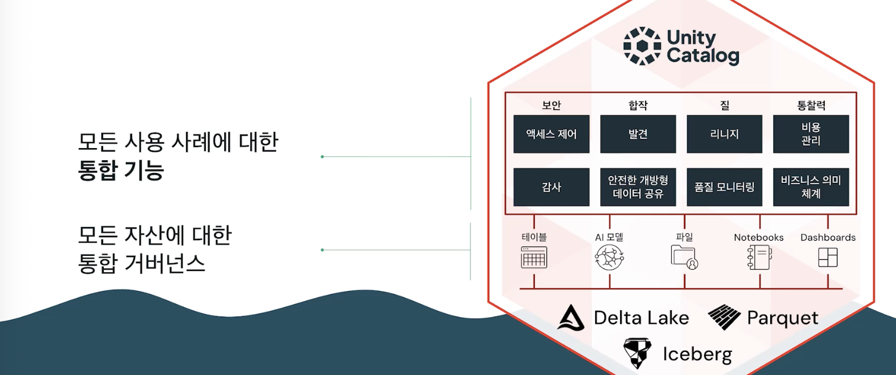
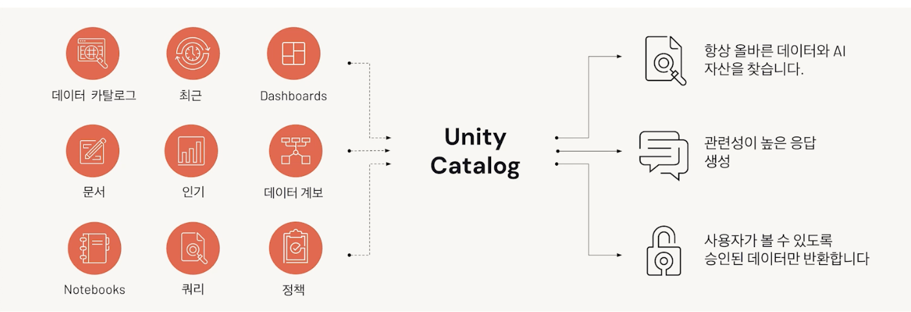
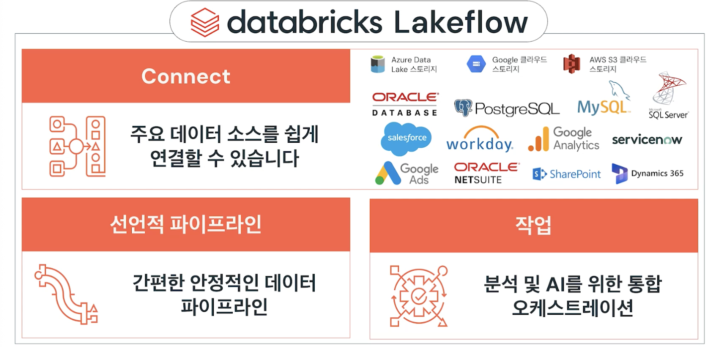
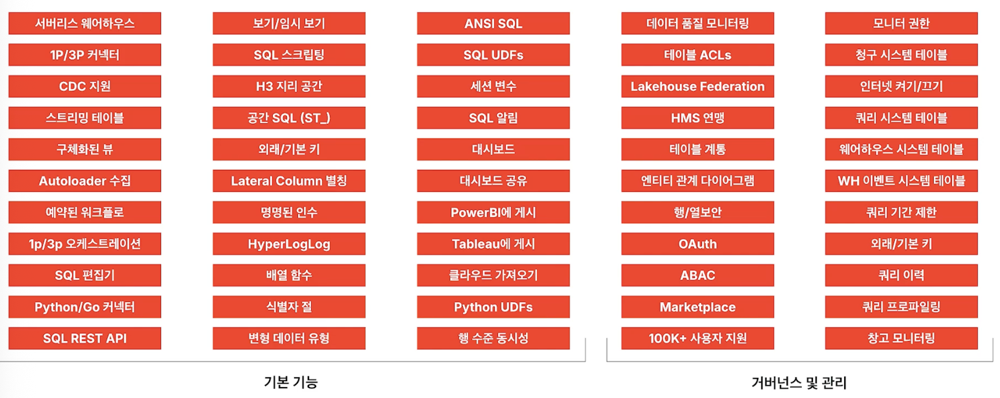
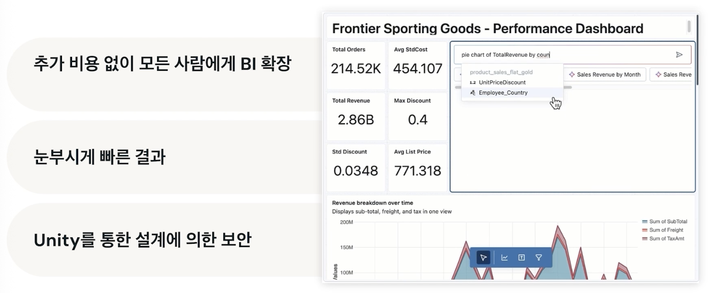
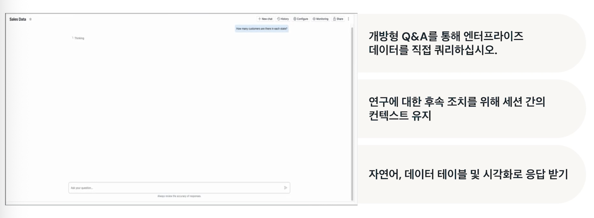
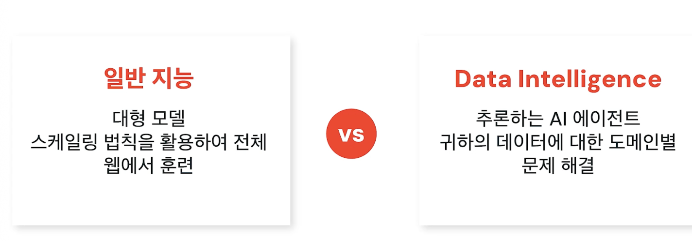
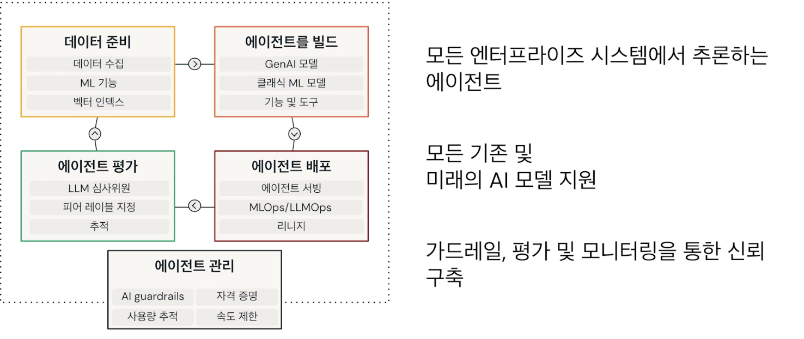

## Databricks Overview

### Databricks Data Intelligence Platform
- 데이터 레이크와 데이터 웨어하우스를 통합된 단일 개방형 플랫폼으로 통합하는 Lakehouse 아키텍처 패러다임의 기반으로 구축
- 클라우드의 개방형 데이터 레이크 위에 있음
- Databricks는 모든 핵심 데이터 및 AI 워크로드를 하나의 통합 환경으로 결합하여 기업이 사일로를 허물고 사용자가 기업 전체에서 데이터가 사용되는 방식에 대한 가시성을 얻을 수 있도록 함

- **데이터 통합 및 소유**
  - 선택한 오픈 소스 Lakehouse 형식 채택
  - 오픈 테이블 포맷(Iceberg, Delta Lake, Parquet)으로 종속에서 자유로움
  - 여러 데이터 복사본으로 인한 불필요 비용 감소

- **Unity Catalog**
  - 광범위하게 액세스할 수 있는 개방형 lakehouse 형식으로 저장된 데이터
  
  - 간단한 통합 거버넌스 계층을 제공하므로 전체 데이터 에코시스템에서 보안 및 규정 준수를 유지할 수 있음
  
  - Unity Catalog로 흐르는 모든 신호는 AI가 학습할 수 있도록 함
  - Databricks는 고유한 데이터 및 비즈니스 컨텍스트에 대한 인식을 얻음

- **Lakeflow**
  
  - 안정적이고 자동화된 데이터 흐름 기록 시스템(수집, ETL, 스트리밍)

- **Databricks SQL**
  
  - 지능형 엔터프라이즈 데이터 웨어하우스
  - 마이그레이션 비용 절감

- **AI/BI**
  - 실제 데이터를 위한 지능형 분석 비즈니스 인텔리전스
  
  - AI 기반 이해로 유용한 결과를 얻음
  
  - Genie를 사용하여 질의를 통해 자연어, 데이터 테이블 및 시각화로 응답 받음

- **Mosaic AI**
  - 도메인별 에이전트 애플리케이션 생성
  
  - 추론 AI 에이전트로 데이터에 대한 도메인 기반 문제 해결
  
  - 정확한 도메인별 결과 얻음