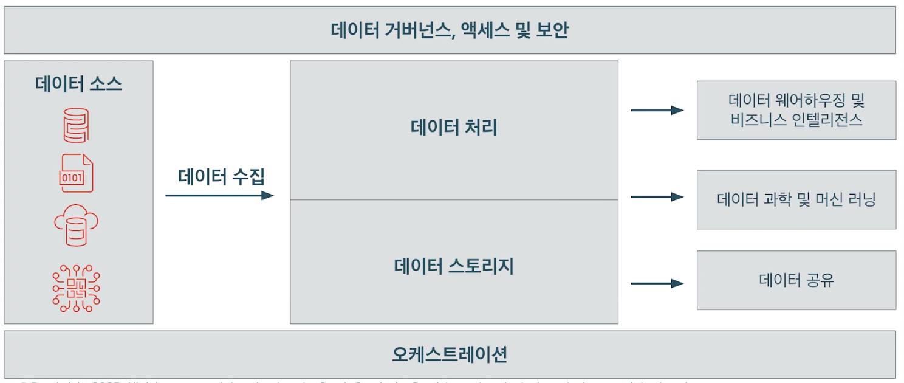
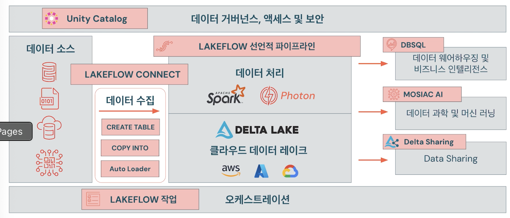

## 데이터 엔지니어링 소개

### 주요 책임
1. 가공되지 않은 데이터를 깨끗하고 신뢰할 수 있는 데이터로 변환
- 다양한 소스에서 데이터 추출
- 오류와 불일치를 제거하기 위한 정리
- 데이터 변환을 통해 데이터를 구조화하고 사용 가능한 형식으로 변환

2. 데이터의 품질과 무결성 보장
- 데이터 정확성, 일관성 및 신뢰성을 모니터링하고 감지하는 프로세스를 개발
- 데이터를 신뢰할 수 있고 의존할 수 있게 유지

3. 데이터 파이프라인 설계, 구축 및 유지 관리
- 다양한 소스에서 스토리지 시스템 및 분석 도구로 데이터가 흐르는 경로
- 이러한 파이프라인을 생성, 최적화 및 자동화함

### 아키텍처 개요

### 일반적인 과제
- 복잡한 데이터 수집 방법
  - 스트리밍 수집
  - 수집을 위한 파일 수동 추적
  - 오류가 발생하기 쉬운 수집 작업 관리

- 주요 데이터 엔지니어링 원칙 지원
  - 애자일 개발, CI/CD 및 버전 관리 
  - 격리된 개발 및 프로덕션 환경

- 타사 오케스트레이션 도구
  - 운영 오버헤드 및 시스템 복잡성 증가
  - 고급 기술과 전문 지식이 필요함
  - 플랫폼 불일치

### Databricks Data Intelligence Platform
- Databricks Data Intelligence Platform를 사용하여 데이터 엔지니어링 간소화

