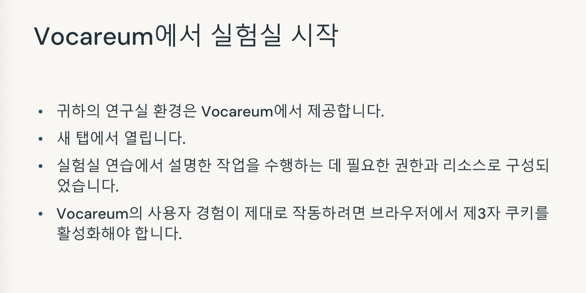
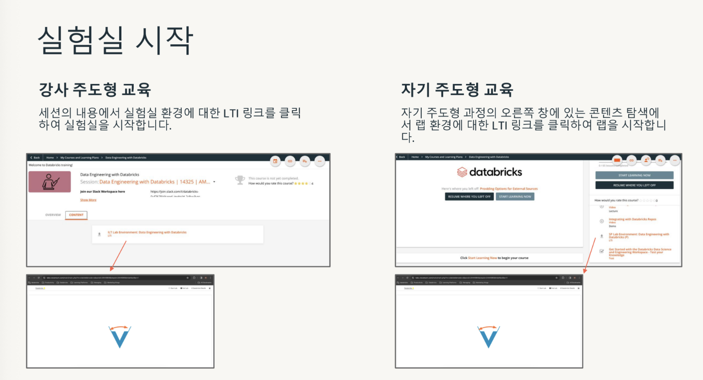
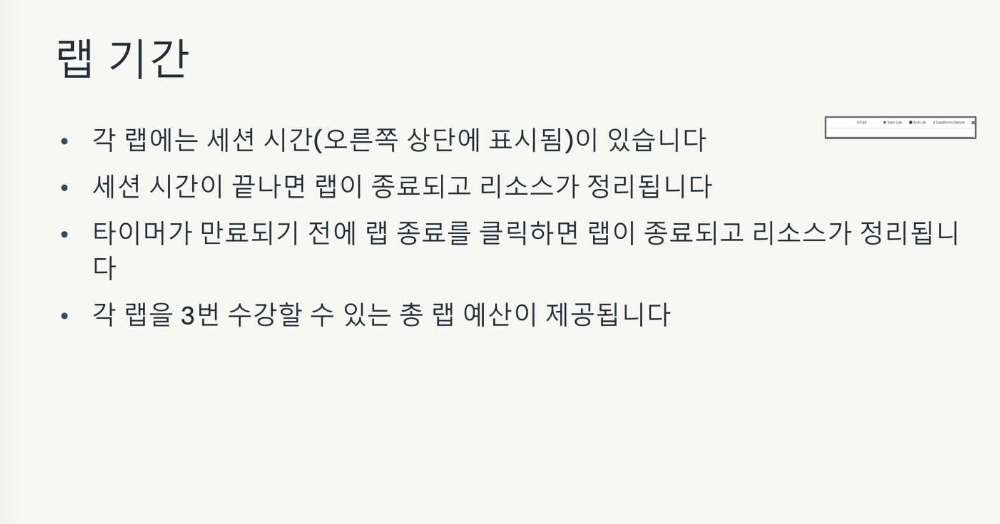
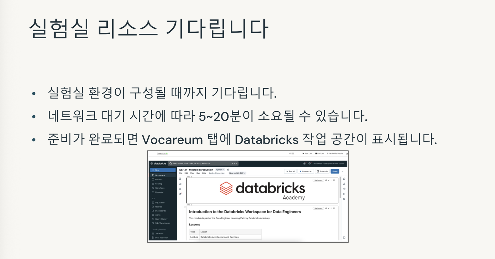
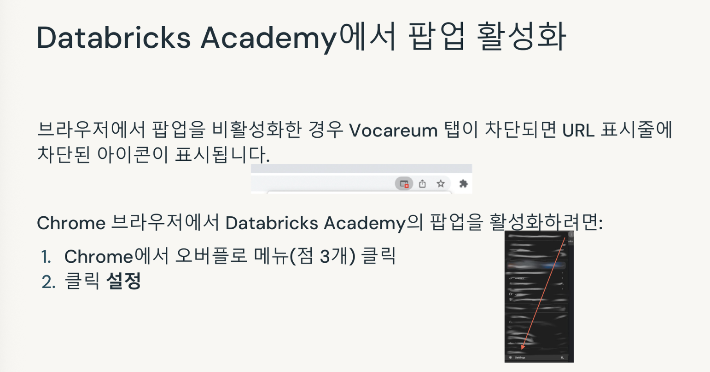
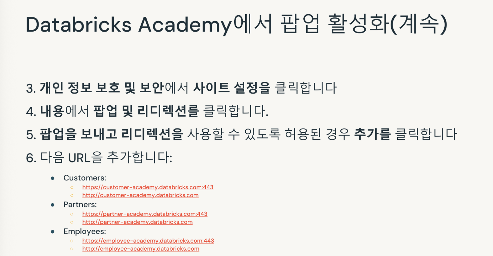
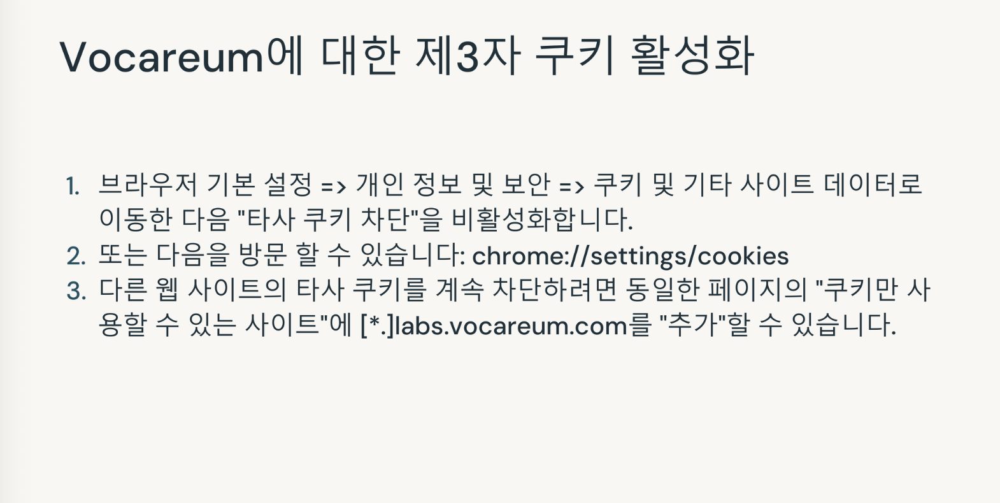
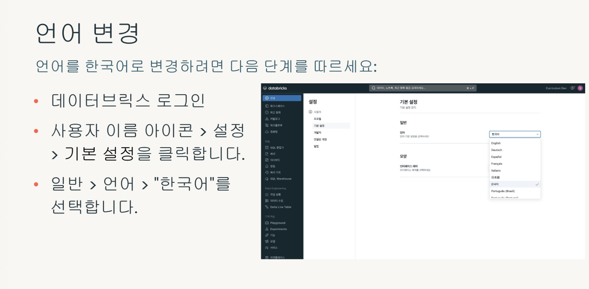
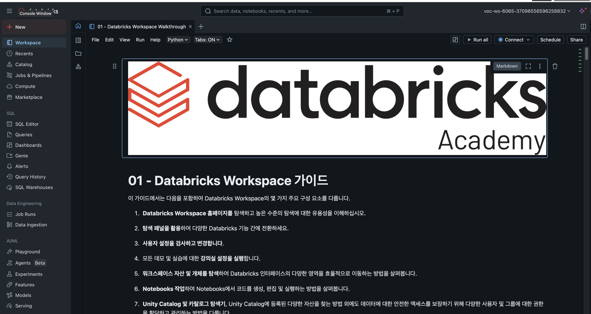

## Course Overview

### 목차
1. Databricks 개요
    1-1. Databricks 인프라
    1-2. Databricks 데이터 인텔리전스 플랫폼
    1-3. Unity Catalog 개요
    1-4. Databricks 워크스페이스 둘러보기

2. 데이터 엔지니어링을 위한 Databricks 사용
    2-1. 데이터 엔지니어링 소개
    2-2. Delta Lake 개요
    2-3. Delta Lake 데이터 수집 기술 개요
    2-4. 데이터 변환 개요
    2-5. Databricks를 사용한 통합 오케스트레이션 개요
    2-6. 종합 데이터 엔지니어링 실습

### 학습 목표
- Databricks 데이터 인텔리전스 플랫폼에서 수행되는 워크로드에 대해 사용 가능한 컴퓨트 옵션 설명
- Databricks 플랫폼 내에서 다양한 데이터 중심 요구 사항에 맞춰 Databricks가 제공하는 제품과 기능을 나열
- Databricks 워크스페이스 UI를 탐색
- Delta Lake의 핵심 개념, 아키텍처 및 이점을 설명
- Delta Lake에 데이터를 수집하기 위해 다양한 기술을 적용
- Databricks에서 데이터 변환을 위한 메달리온 아키텍처를 설명
- Delta Live Tables와 워크플로가 Databricks에서 통합 오케스트레이션을 어떻게 용이하게 하는지 설명

### 실습 환경(Databricks Labs)
- 실습 환경은 Vocareum에서 제공
- 새로운 탭에서 열림
- 실습 연습에서 설명된 태스크를 완료하는 데 필요한 권한과 리소스로 구성
- Vocareum의 사용자 경험이 제대로 작동하려면 브라우저에서 타사 쿠키(third party cookie)를 활성화해야 함
- 팝업을 활성화

---
## Accessing Vocareum Labs in Training

### 실험실 환경 액세스

### 팝업 활성화

### 제3자 쿠키 활성화

### Changing Language in Vocareum

### Vocareum Labs

