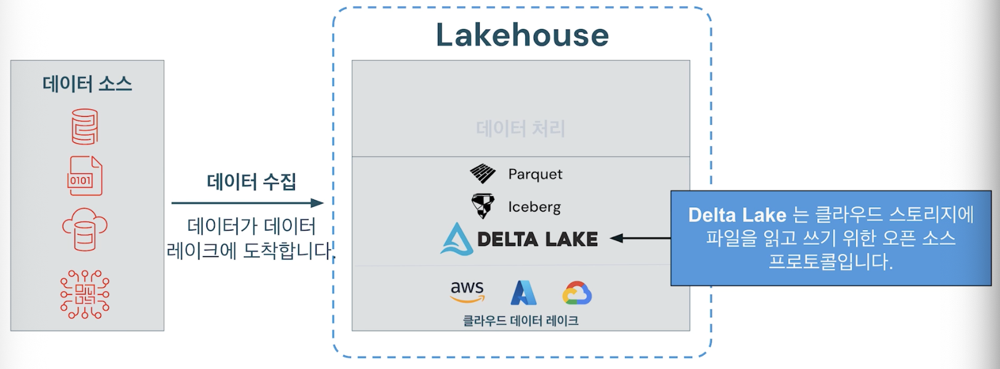
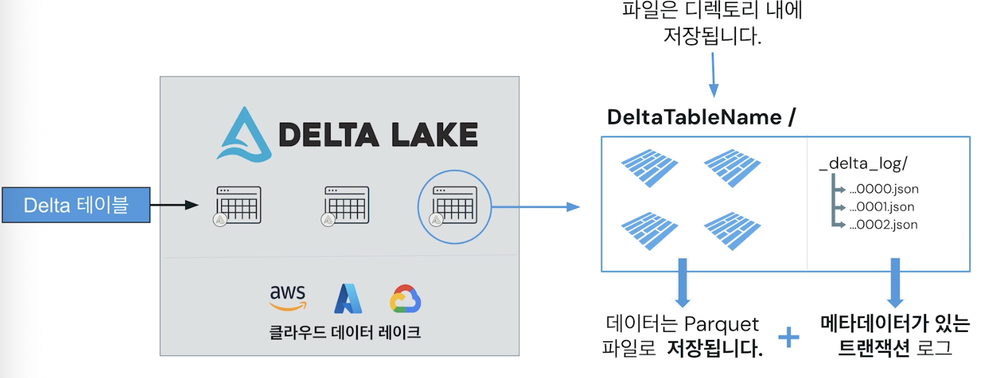
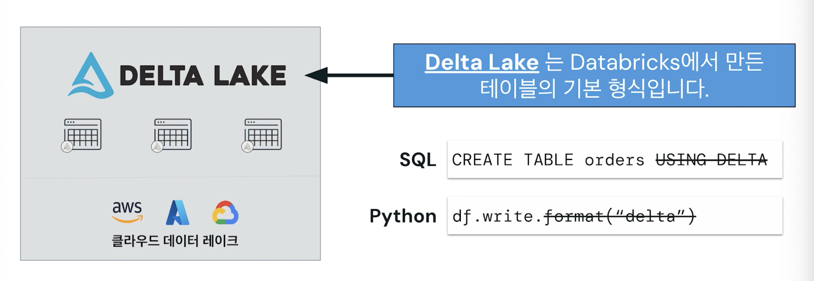

## Delta Lake Overview

### Delta Lake 개요

- 클라우드 스토리지에 파일을 읽고 쓰기 위한 오픈 소스 프로토콜
- Delta Lake를 통합
  - 기본 데이터 레이크를 데이터 레이크의 유연성 및 확장성
  - 데이터 웨어하우스의 안정성 및 성능을 결합
  - 레이크하우스로 전환할 수 있음
- Lakehouse는 본절적으로 Lake가 맨 위에 있는 개방형 데이터 레이크

- Delta Lake 내에서 Delta 테이블을 활용함
- 내부적으로 delta 테이블은 폴더 디렉터리 내에 데이터를 저장함
- 디렉터리 내에서 데이터는 Parquet 파일로 저장됨
- Delta는 Parquet 파일과 함께 JSON 파일로 저장된 Delta 로그를 추가함
- Delta 로그는 parquet 파일 및 테이블 버전인 데이터에 대한 모든 트랜잭션을 추적함
- 트랜잭션 로그는 델타 테이블에 다양한 기능을 제공함
    - 데이터 삽입, 삭제 또는 업데이트하면 델타는 기본적으로 로그 파일인 트랜잭션을 추가
    - 테이블은 업데이트되고 관리되는 상태로 유지됨
    - 데이터에 대한 일관된 보기를 쉽게 얻을 수 있으며 실제로 시간을 거슬러 올라갈 수 있음

- Delta Lake는 테이블을 만들기 위한 기본 형식(SQL, Python, Scala, Java 등 지원)
- create table 문 또는 write 메서드를 실행하는 것만큼 쉽게 Delta Lake를 사용할 수 있음
- SQL에서 Delta를 사용하고 Python에서 delta 형식을 지정하는 것은 선택 사항

#### 주요 특징들
- ACID 트랜잭션
  - Delta Lake는 클라우드 기반 오브젝트 스토리지에 저장된 데이터에 대해 테이블 수준에서 ACID 트랜잭션 보장을 제공
  - Atomicity: 전체 트랜잭션이 성공하거나 완전히 실패하는 것
  - Consistency: 지정된 데이터 상태가 동시 작업에 의해 관찰되는 방식 보장
  - Isolation: 동시 작업이 서로 충돌하는 방식
  - Durability: 커밋된 변경 내용이 영구적임
- DML 작업
  - INSERT, UPDATE, DELETE, MERGE
- 타임 트래블
  - Delta 테이블은 테이블의 각 버전(쓰기)에 대한 트랜잭션 로그를 유지함
  - 기록 쿼리, 스냅샷 격리, 감사
- 스키마 진화 및 집행
  - 스키마 변화: 데이터가 변경됨에 따라 Delta 테이블의 스키마를 자동으로 조정함
  - 스키마 적용: Delta 테이블에 기록된 모든 데이터가 테이블의 정의된 스키마와 일치하는지 확인함
- 그 외
  - 통합 배치 및 스트리밍
  - 성능
  - 확장 가능한 메타데이터
  - 최적화
  - Delta Lake는 오픈소스!