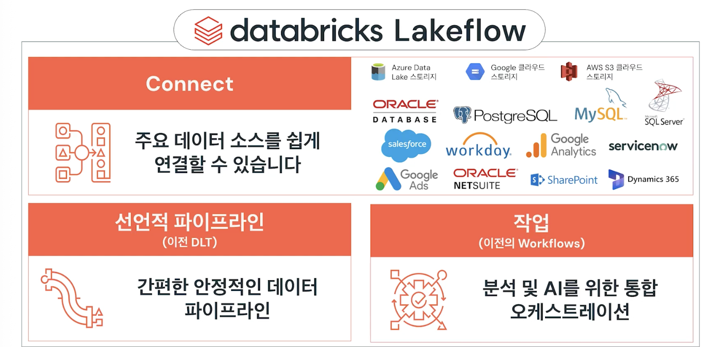
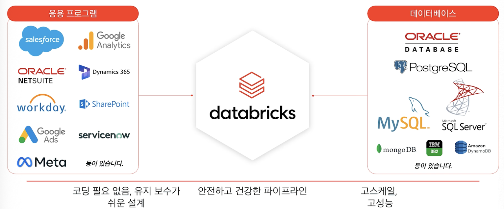
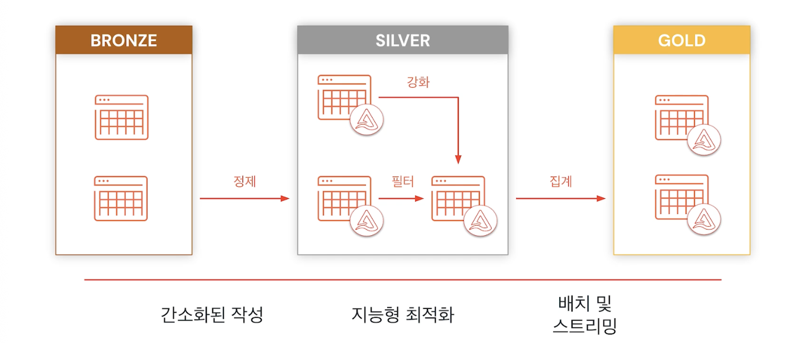

## Lakeflow Overview

### Lakeflow Connect
- 파일 업로드
  - Databricks에 로컬 파일 업로드
    - 볼륨에 파일 업로드
    - 로컬 파일에서 테이블 만들기

- 표준 커넥터(Standard Connector)
  - 다양한 원본과 방법을 사용하여 lakehouse에 데이터를 수집
  - 지원되는 원본:
    - 클라우드 오브젝트 스토리지
    - Kafka
    - 기타
  - 수집 방법:
    - 배치 
    - 증분 배치
    - 스트리밍

- 관리형 커넥터(Manage Connector)

  - 다음에서 lakehouse로 데이터 수집:
    - SaaS 애플리케이션
    - 데이터베이스
  - 효율적인 증분 읽기 및 쓰기를 활용하여 데이터 수집을 더 빠르고 확장 가능하며 비용 효율적으로 만듦

### Lakeflow 선언적 파이프라인(Lakeflow Declarative Pipelines)
- 자동 증분 지정을 사용하는 선언적 파이프라인

### Lakeflow 작업(Lakeflow Workflows)
- 데이터 및 AI에 대한 안정적인 오케스트레이션

