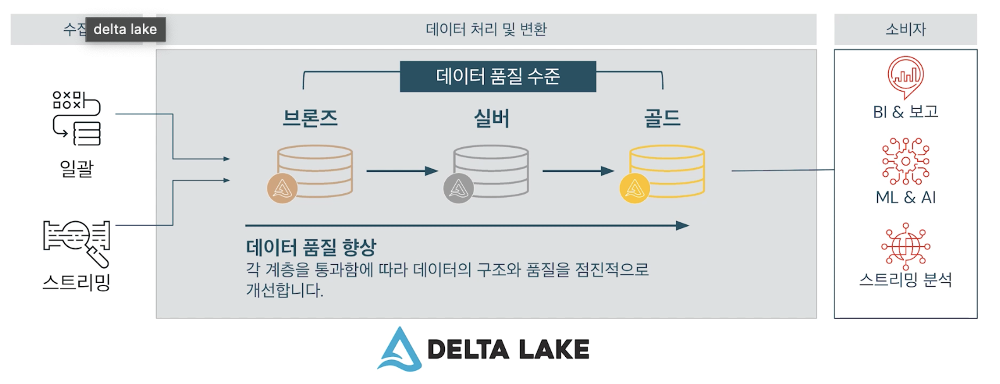

## Data Transformation Overview

### 데이터 변환 개요

- Lakehouse 내에서 Apache Spark 및 오픈 소스 메몰 내 분산 처리 엔진을 사용하여 데이터를 처리함
- 확장 가능하며 배치 및 스트리밍 작업은 물론 SQL, Python, Scala 등을 지원
- Photon
  - Delta Lake를 사용하여 SQL 쿼리를 최적화하고 처리를 가속화 할 수 있는 Databricks용 고성능 쿼리 엔진

- 데이터를 처리할 때 Databricks는 데이터 엔지니어링 아키텍처 내의 데이터 처리 구성 요소에서 데이터를 변환하기 위해 메달리온 아키텍처를 사용하는 것이 좋음
- 거의 모든 Delta Lake 사용 사례에서 데이터 변환 파이프라인을 레이크하우스 내에서 데이터를 구성하는 데 사용되는 데이터 디자인 패턴인 메달리온 아키텍처로 구성함
- 브론즈, 실버, 골드 메달리온 데이터 품질 수준을 기반으로 함
- 데이터 레이크의 원래 원시 데이터가 기본 형식으로 브론즈 레이어, 실버 레이어, 골드 레이어의 소비자 수준 데이터로 각 레이어를 통과하면서 데이터의 구조와 품질을 점진적으로 개선함
  - **브론즈 레이어**
  
    - 외부 소스 시스템에서 원시 데이터를 수집하기만 하면 됨
    - 데이터 품질과 상관없이 가능한 한 빨리 데이터를 가져옴
    - 현재 및 향후 프로젝트 모두에 유용하게 사용할 수 있도록 데이터를 유지하고 로드 날짜 또는 시간, 프로세스 ID 등을 캡처하는 추가 메타데이터 열을 추가 함
    - 데이터를 원시로 수집함으로써 시스템이나 처리 로직의 버그에 노출되는 것을 방지할 수 있음
    - 원래 존재했던 데이터를 가지고 있으며 언제든 다시 원복 가능
    - 저장 비용이 저렴함
    - 규제 요구 사항에 따라 데이터를 Delta Lake로 수집할 때 PII라고도 하는 개인 식별 정보를 제거할 수 도 있음

  - **실버 레이어**
  
    - 브론즈 레이어 데이터가 필터링, 정리, 결합 및 보강된 버전으로 처리됨
    - 데이터의 구조를 정의하고 필요에 따라 스키마를 적용하거나 스키마를 발전시킴
    - 실버 레이어는 많은 프로젝트에서 기업을 위한 단일 정보 소스가 됨(Single Truth of Source)
    - 오류를 수정하고, 비즈니스 데이터를 추가하고, 비즈니스 규칙을 적용하는 등의 작업을 수행함
    - 정제된 데이터 테이블로 모든 고유 고객, 트랜잭션 등과 같은 데이터를 포함함

  - **골드 레이어**
  
    - 소비자에게 준비된 정제된 데이터가 포함되어 있음
    - 사용 사례에 따라 실버 데이터의 비즈니스 수준 집계가 포함될 수 있음
    - 사용자 및 애플리케이션에 다운스트림으로 전달되는 특정 프로젝트 또는 보고서에 대해 형식이 지정됨
    - 이러한 테이블은 델타 형식으로 저장하거나 Spark 작업 또는 SQL 쿼리에서 사용할 수 있으며 외부 시스템에 복제할 수도 있음
    - 많은 엔진에는 Delta Lake 리더가 있으며 균일한 Delta 테이블을 사용하여 다른 응용 프로그램에서도 기본적으로 읽을 수 있음

- Databricks는 삭제, 업데이트 및 병합에 대한 지원을 제공할 수 있음
- 비즈니스 로직이 변경되면 실버 및 골드 테이블을 업데이트하거나 삭제하고 스트림 또는 일괄 처리 프로세스를 다시 시작하여 변경 사항을 적용할 수 있음

- 실제 데이터 엔지니어링 파이프라인은 종종 복잡성을 많이 띄고 있음
- 스트리밍 데이터, 배치파일, 데이터 레이크를 포함한 다양한 소스에서 데이터를 읽는 것부터 시작하여 여러 단계가 포함됨