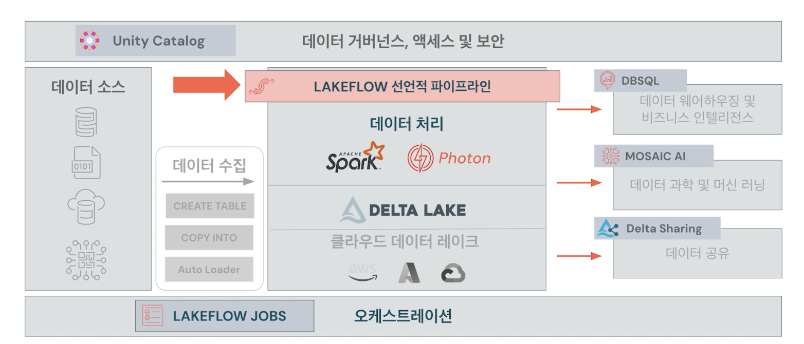
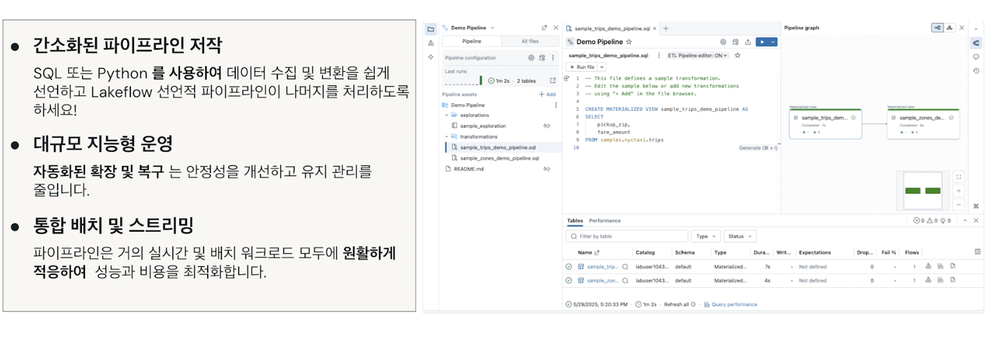
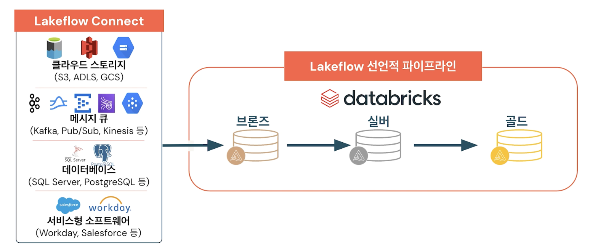
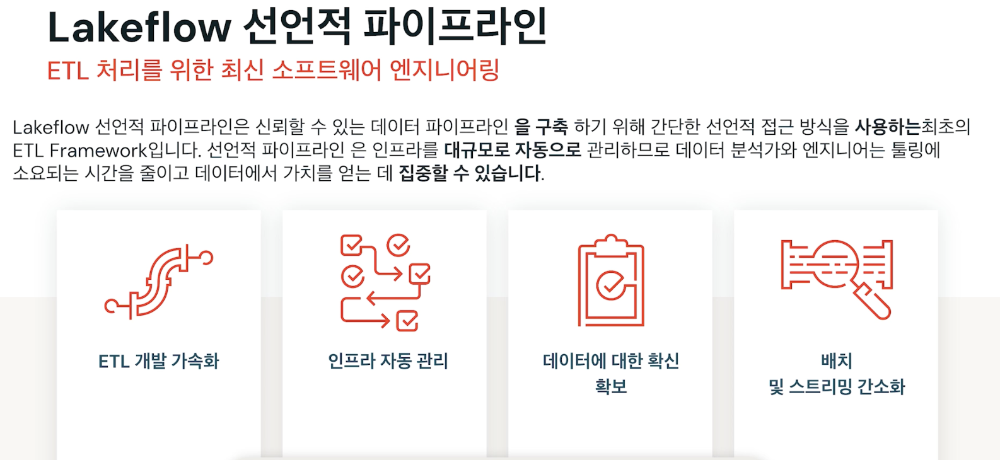

## Performing ETL with Lakeflow Declarative Pipelines

- Lakeflow Declarative Pipeline은 데이터 팀이 스트리밍 및 일괄 처리 ETL을 비용 효율적으로 간소화하는 데 도움이 되는 Databricks 데이터 인텔리전스 플랫폼을 위한 선언적 ETL 프레임워크
- 스트리밍 수집 및 변환을 자동화 및 확장하여 강력한 파이프라인 가시성을 제공하여 ETL 및 실시간 분석을 함
- Lakeflow Declarative Pipeline을 사용하면 대규모로 신뢰할 수 있는 데이터 파이프라인을 훨씬 더 쉽게 구축하고 관리할 수 있음

- SQL 또는 Python을 사용하여 데이터 수집 및 변환 작업을 정의할 수 있음
- Lakeflow는 실행 계획, 오류 처리, 종속성 관리를 백그라운드에서 처리함
- 데이터 볼륨이 증가함에 따라 자동으로 확장되고 오류로부터 복구됨
- 워크로드 유형에 적응하고 성능과 비용 효율성을 최적화함

- Lakeflow Connect를 사용하면 다양한 외부 소슬로부터 데이터 수집을 간단하게 할 수 있음
- 데이터가 연결되면 Lakeflow Declarative Pipeline은 수집 및 변환을 효율적으로 처리할 수 있음
- 선언적 파이프라인은 배치 또는 스트리밍 처리를 수행하는지 여부에 관계없이 증분 또는 스트리밍 ETL을 위한 것
- 데이터 원본에 관계없이 선언적 파이프라인은 메달리온 아키텍처를 통해 데이터를 이동하기 위한 것

