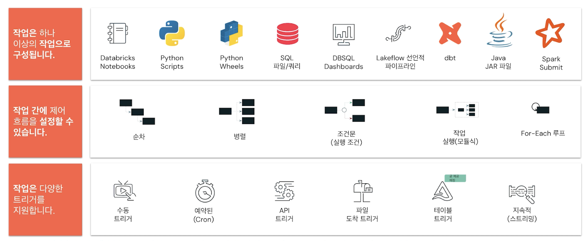
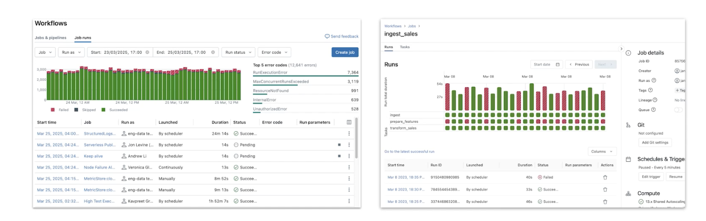
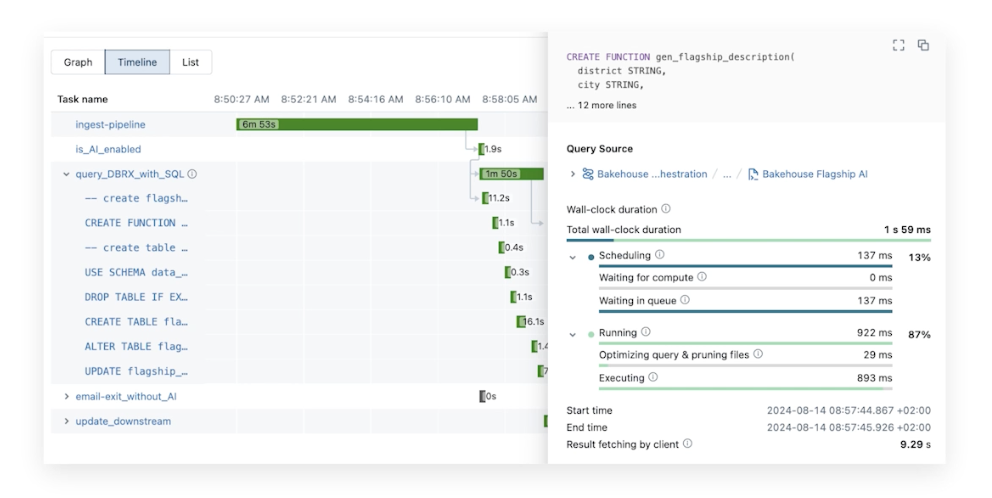

## Unified Orchestration Using Lakeflow Jobs

### Lakeflow 작업을 사용한 통합 오케스트레이션
- 전체 플랫폼을 위한 완전 관리형 클라우드 기반 범용 작업 오케스트레이션 서비스
- 데이터 엔지니어, 데이터 과학자 및 분석가가 Notebooks, SQL, ML 모델 등에 대한 작업 등을 사용하여 신뢰할 수 있는 데이터, 분석 및 AI Lakeflow 작업을 구축할 수 있음
- 사용하기 쉬운 포인트 앤 클릭 인터페이스
- Lakeflow 선언적 파이프라인은 Lakeflow 작업의 태스크 일 수 있음

### Lakeflow 작업의 구성 요소

- Lakeflow 작업 구축은 완료하려는 작업 유형을 고려하는 것부터 시작됨
- 제어 흐름에서 해당 작업을 실행하는 방법을 정의할 수 있음
- 마지막으로 작업을 시작하는데 필요한 트리거 유형을 정의
- 모든 사용자가 작업을 간단하고 편리하게 빌드할 수 있도록 여러가지 옵션을 제공함

- 간단하고 직관적인 모니터링 UI는 모든 워크플로우 실행에 대한 실시간 메트릭과 상세한 분석을 제공함
- 드릴다운하여 실패하는 태스크와 원인을 확인할 수 있음

- 작업 실행 이력에 대한 자세한 내용을 확인할 수 있음
  - 문제 해결 및 최적화를 위한 중요 경로 시각화
  - 쿼리 이력과 함께 성능 인사이트를 위한 라이브 쿼리 프로필
  - 검색 가능한 쿼리 프로필